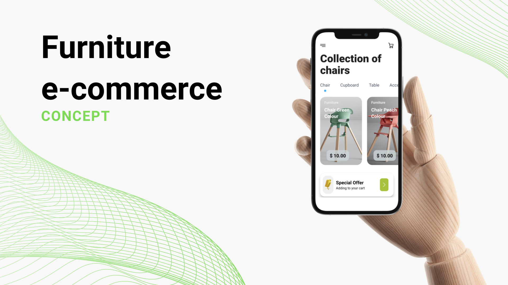

# React Native credit card interface

<p>
  <!-- iOS -->
  
  <!-- Android -->
  
  <!-- Web -->
  
</p>


Concept of a furniture e-commerce developed with React Native. Soon, new features will be added to it.




### Installing application dependencies
```sh
npm i
```

### Running the app with Expo on Android or iOS
```sh
npm run <android | ios>
```

### List of future new features
- [x] Home screen
- [x] Product details
- [ ] Shopping cart
- [ ] ...
- [ ] Checkout screen

### Design

Design created by [Karina](https://dribbble.com/Karinaa_a/shots) (Web Design | UI/UX | Illustrations | Icons | Graphic Design).

The original design proposal can be found on [Dribbble](https://dribbble.com/shots/14012921-Furniture-Store-App).
### References:

- [Expo TypeScript guide](https://docs.expo.dev/versions/latest/guides/typescript/)